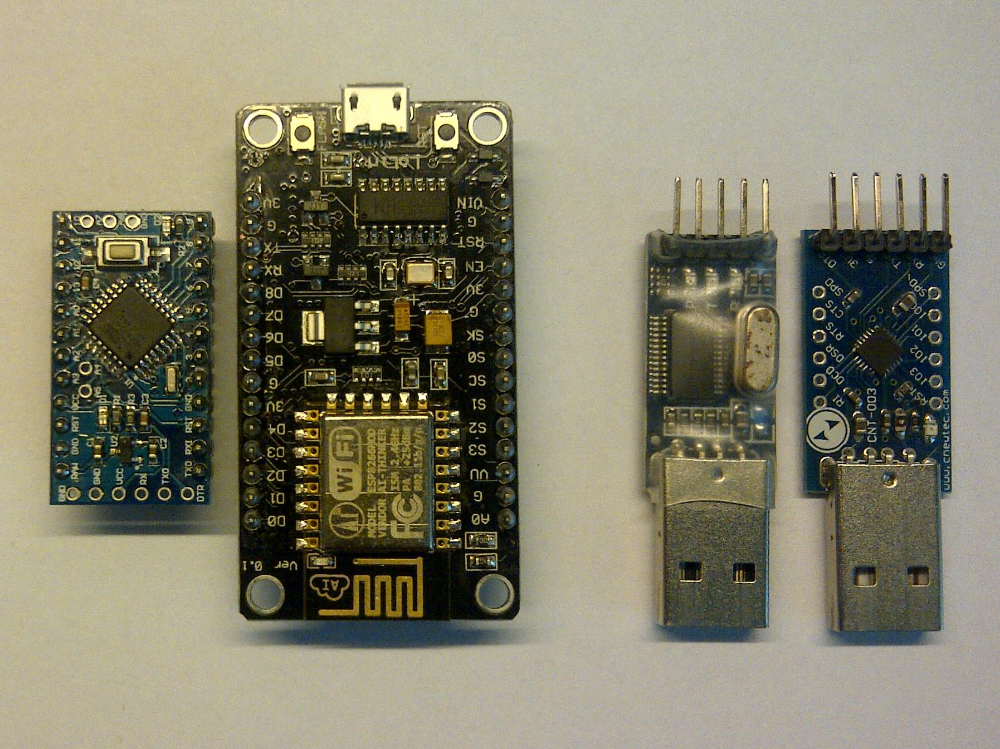
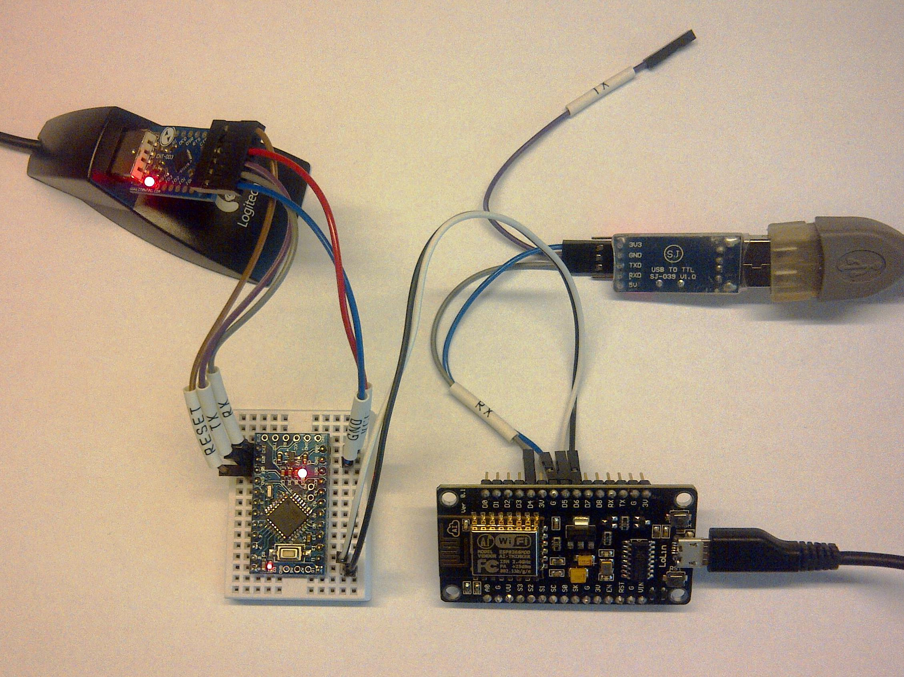
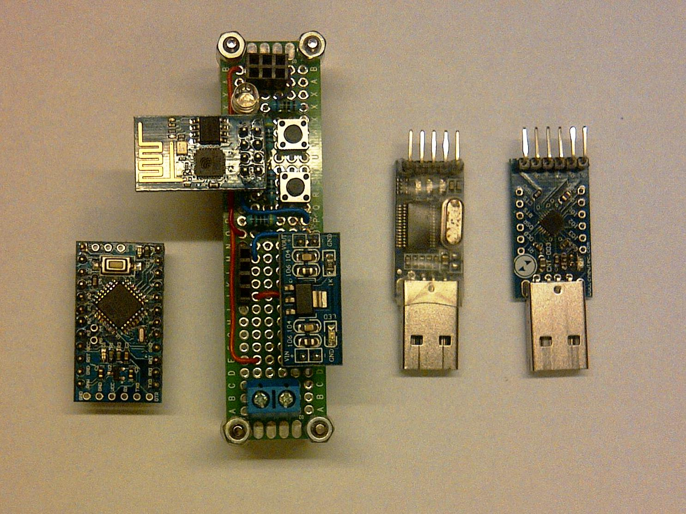
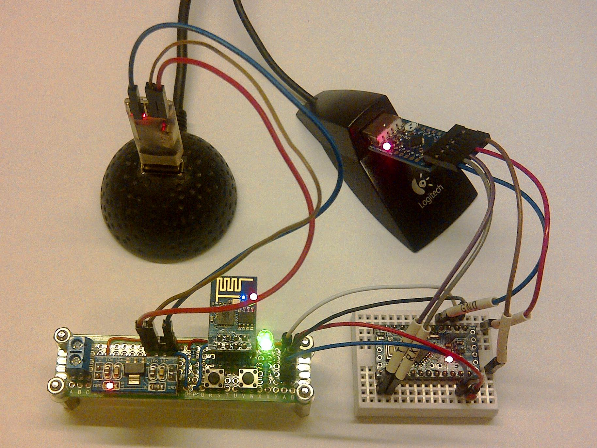

#esp-just-slip

[SLIP (Serial Line Internet Protocol)](https://en.wikipedia.org/wiki/Serial_Line_Internet_Protocol) provides easy to implement method to encapsulate data packets sent over a serial connection. The esp-just-slip is an implementation of SLIP prepared for [ESP8266 SoC](http://espressif.com/en/products/esp8266/). It is provided as C module [justslip](justslip/) and includes verification of data integrity with [CRC16](https://en.wikipedia.org/wiki/Crc16). Sample implementation of this module is available in file [user_main.c](user/user_main.c) and demonstrates sending of data packets between arduino and ESP8266.


##Implementation

esp-just-slip can set data using hardware UART0 serial or using software serial. Software serial provides flexibility which other pins to use for communication if UART0 is already used for other purposes. Software serial is implemented using [esp8266 software uart](https://github.com/plieningerweb/esp8266-software-uart) by [Andreas Plieninger](https://github.com/plieningerweb). To provide verification if data has been transmitted correctly [CRC16](https://en.wikipedia.org/wiki/Crc16) is used.
 


##Sample Test Scenarios

Testing of this application using s/w and h/w serial ports may be performed with sample hardware configurations defined below.

Please note that most of Arduino modules operate on 5V while ESP8266 on 3.3V To make the connection easier  Arduino Pro Mini 3.3V has been used that provides direct compatibility of pin voltage to ESP8266. In other cases a 5V <> 3.3V voltage level shifter should be used or ESP8266 may be damaged if connected directly to 5V Arduino pins. 


###SLIP over S/W Serial - Hardware Set Up
* Arduino Pro Mini 3.3V
* ESP-12E LoLin V3 with USB by wemos.cc
* Two USB-UART generic dongles used to
  * monitor serial traffic received by ESP-12E
  * upload Arduino and then monitor serial traffic received by Arduino



The following pins are used to connect particular modules:

Module   | Pin Description | Pin No. | <> | Pin No. | Pin Description | Module
-------- | -------------- | ------- |----| --------|----------------| ---------------
ESP-12E  | Soft UART Rx   | GIPIO14 | <> | 11      | Soft UART Tx   | Arduino
ESP-12E  | Soft UART Tx   | GIPIO15 | <> | 10      | Soft UART Rx   | Arduino
ESP-12E  | Ground         | GND     | <> | GND     | Ground         | Arduino
ESP-12E  | UART1 Tx       | GPIO02  | <> | Rx      | UART Rx        | USB-UART ESP 
ESP-12E  | Ground         | GND     | <> | GND     | Ground         | USB-UART ESP 
Arduino  | UART Tx        | TXO     | <> | Rx      | UART Rx        | USB-UART INO 
Arduino  | UART Rx        | RXI     | <> | Tx      | UART Tx        | USB-UART INO 
Arduino  | Reset          | RST     | <> | DTR     | UART DTR       | USB-UART INO 
Arduino  | Power Supply   | RAW     | <> | 5V      | Power Supply   | USB-UART INO 
Arduino  | Ground         | GND     | <> | GND     | Ground         | USB-UART INO 


Please refer to folder [documents](documents/) for additional pictures of connections.


###SLIP over H/W Serial - Hardware Set Up
* Arduino Pro Mini 3.3V
* ESP-01 with 3.3V power supply
* Two USB-UART generic dongles used to
  * monitor serial traffic received by ESP-01
  * upload Arduino and then monitor serial traffic received by Arduino



The following pins are used to connect particular modules:

Module  | Pin Description | Pin No. | <> | Pin No. | Pin Description | Module
------- | -------------- | ------- |----| --------|----------------| ---------------
ESP-01  | UART0 Rx       | GIPIO3  | <> | TXD     | UART Tx        | Arduino
ESP-01  | UART0 Tx       | GIPIO1  | <> | RXD     | UART Rx        | Arduino
ESP-01  | Ground         | GND     | <> | GND     | Ground         | Arduino
ESP-01  | UART1 Tx       | GPIO02  | <> | Rx      | UART Rx        | USB-UART ESP 
ESP-01  | Ground         | GND     | <> | GND     | Ground         | USB-UART ESP 
Arduino | Soft UART Tx   | 11      | <> | Rx      | UART Rx        | USB-UART INO 
Arduino | Soft UART Rx   | 10      | <> | Tx      | UART Tx        | USB-UART INO 
Arduino | Reset          | RST     | <> | DTR     | UART DTR       | USB-UART INO 
Arduino | Power Supply   | RAW     | <> | 5V      | Power Supply   | ESP-01 PS
Arduino | Ground         | GND     | <> | GND     | Ground         | USB-UART INO 


Please refer to folder [documents](documents/) for additional pictures of connections.


###Software Overview
ESP8255 application should be compiled and loaded to module using provided make file. Use define in file [user_main.c](https://github.com/krzychb/esp-just-slip/blob/master/user/user_main.c) to choose between SLIP over s/w or h/w serial.

``` c
//
// comment define below if you would like to use Softuart
//
#define USE_HW_SERIAL
``` 

Arduino should be loaded using [Arduino IDE](https://www.arduino.cc/en/Main/Software). There are two sketches for both s/w and h/w serial test scenarios available in the following folders:
* [ino-just-slip-sws](ino-just-slip-sws/) - SLIP over S/W Serial
* [ino-just-slip-hws](ino-just-slip-hws/) - SLIP over H/W Serial

Functionally of those sketches is identical to the application loaded on ESP8266. There are some (slight) differences in code as Arduino sketches are written in C++ while ESP8266 application is written in pure C. 

Once applications are started the following information is displayed on [Arduino Serial](documents/just-slip-arduino-terminal.png) and [ES8266 UART1](documents/just-slip-esp8266-terminal.png) terminals:
 
``` 
...
4F 2E 00 00 AB E6 71 77 4E E0 76 D8 :  2% 
50 2E 00 00 23 80 4D 60 3D B5 DA C8 :  2% 
51 2E 00 00 51 3C 15 59 C6 E6 32 0E :  2% 
...
```
First four columns contain counter of packets received, next 8 bytes contain random data and last column contains percentage of packets lost or corrupt. Packets are sent every 30 ms at 57600 bps. Checking of UART input buffer for data is done every 10 ms. 

Basing on resuts of first test scenario (SLIP over s/w serial) on average 1% of packets received by Arduino are lost or corrupt. On ESP8266 side this value is below 0.5% (0% reported on terminal). The reason of bigger number of packet  lost/corrupt on Arduino side is likely ESP8266 Wi-Fi routines that interrupt operation of SoftUART sending the packets. This is only a hypothesis that should be verified by specific testing.

Packages lost or corrupt for second test scenario were 0% on both Arduino and ESP8266 side.


The following s/w version have been used when developing and testing of esp-just-slip:
* [Unofficial Development Kit for Espressif ESP8266](http://programs74.ru/udkew-en.html) v2.0.8 (esp_iot_sdk_v1.3.0_15_08_08)
* [Arduino iDE 1.6.5](https://www.arduino.cc/en/Main/Software)
* [Arduino SoftwareSerial 1.0.0](https://www.arduino.cc/en/Reference/SoftwareSerial) - available through Arduino iDE > Sketch > Include Library > Manage Libraries


##Software API

The following functions are implemented:
```c
uint8_t ICACHE_FLASH_ATTR slipDecodeSerial(Softuart *softuart, uint8_t *dataBuffer);
uint8_t ICACHE_FLASH_ATTR slipDecodeSerialUart0(uint8_t *dataBuffer);
void ICACHE_FLASH_ATTR slipEncodeSerial(Softuart *softuart, uint8_t *dataBuffer, uint8_t nCount);
void ICACHE_FLASH_ATTR slipEncodeSerialUart0(uint8_t *dataBuffer, uint8_t nCount);
uint8_t ICACHE_FLASH_ATTR readKeyboard(uint8_t *dataBuffer);
uint8_t ICACHE_FLASH_ATTR appendCrc16(uint8_t *dataBuffer, uint8_t nCount);
bool ICACHE_FLASH_ATTR checkCrc16(uint8_t *dataBuffer, uint8_t nCount);
```

###Read and Decode Data
```c
//
// *softuart - pointer to software UART
// *dataBuffer - pointer to data buffer to store received data
//
// returned value - number of bytes read to dataBuffer
//
uint8_t ICACHE_FLASH_ATTR slipDecodeSerial(Softuart *softuart, uint8_t *dataBuffer)
```
Read SLIP encoded data from software serial port, decode them and store in data buffer.

```c
//
// *dataBuffer - pointer to data buffer to store received data
//
// returned value - number of bytes read to dataBuffer
//
uint8_t ICACHE_FLASH_ATTR slipDecodeSerialUart0(uint8_t *dataBuffer)
```
Read SLIP encoded data from UART0 serial port, decode them and store in data buffer.


###Encode and Write Data
```c
//
// *softuart - pointer to software UART
// *dataBuffer - pointer to data buffer to read data from
// nCount - number of bytes to read form dataBuffer
//
void ICACHE_FLASH_ATTR slipEncodeSerial(Softuart *softuart, uint8_t *dataBuffer, uint8_t nCount)
```
SLIP encode data taken from data buffer and send the over the software serial port.

```c
//
// *dataBuffer - pointer to data buffer to read data from
// nCount - number of bytes to read form dataBuffer
//
void ICACHE_FLASH_ATTR slipEncodeSerialUart0(uint8_t *dataBuffer, uint8_t nCount)
```
SLIP encode data taken from data buffer and send the over the UART0 serial port.


###Append CRC16 to Data
```c
//
// *dataBuffer - pointer to data buffer to calculate and append crc16
// nCount - number of data bytes in dataBuffer
//
// returned value - number of bytes in data buffer including crc16
//
uint8_t ICACHE_FLASH_ATTR appendCrc16(uint8_t *dataBuffer, uint8_t nCount)
```
Calculate CRC16 for data contained in data buffer and append result to the end of data buffer


###Check Data Integrity
```c
//
// *dataBuffer - pointer to data buffer
// nCount - number of data bytes in dataBuffer including crc16
//
// returned value - true of false depending on result of crc16 check
//
bool ICACHE_FLASH_ATTR checkCrc16(uint8_t *dataBuffer, uint8_t nCount)
```
Perform data integrity check by comparing CRC16 calculated for input data against CRC16 received.


###Print Data Buffer
```c
//
// *dataBuffer - pointer to data buffer
// nCount - number of data bytes in dataBuffer including crc16
//
void ICACHE_FLASH_ATTR printBuffer(uint8_t *dataBuffer, uint8_t nCount)
```
Print values from dataBuffer for diagnostic purposes. The last two bytes of dataBuffer contain CRC16 and are not printed.


##Acknowledgments

Development of this esp-just-slip was done using the following resources:

* [esp8266 software uart](https://github.com/plieningerweb/esp8266-software-uart) by [Andreas Plieninger](https://github.com/plieningerweb)
* [Unofficial Development Kit for Espressif ESP8266 by Mikhail Grigorev](http://programs74.ru/udkew-en.html)

Thank you guys for your contribution to ESP8266 community. It is a great pleasure to work with applications you have developed.


##Contributing

Please report any [issues](https://github.com/krzychb/esp-just-slip/issues) and submit [pull requests](https://github.com/krzychb/esp-just-slip/pulls). Feel free to contribute to the project in any way you like! 


##Author

krzychb


##Donations

Invite me to freshly squeezed orange juice.


##LICENSE - "MIT License"

Copyright (c) 2015 krzychb

Permission is hereby granted, free of charge, to any person obtaining a copy of this software and associated documentation files (the "Software"), to deal in the Software without restriction, including without limitation the rights to use, copy, modify, merge, publish, distribute, sublicense, and/or sell copies of the Software, and to permit persons to whom the Software is furnished to do so, subject to the following conditions:

The above copyright notice and this permission notice shall be included in all copies or substantial portions of the Software.

THE SOFTWARE IS PROVIDED "AS IS", WITHOUT WARRANTY OF ANY KIND, EXPRESS OR IMPLIED, INCLUDING BUT NOT LIMITED TO THE WARRANTIES OF MERCHANTABILITY, FITNESS FOR A PARTICULAR PURPOSE AND NONINFRINGEMENT. IN NO EVENT SHALL THE AUTHORS OR COPYRIGHT HOLDERS BE LIABLE FOR ANY CLAIM, DAMAGES OR OTHER LIABILITY, WHETHER IN AN ACTION OF CONTRACT, TORT OR OTHERWISE, ARISING FROM, OUT OF OR IN CONNECTION WITH THE SOFTWARE OR THE USE OR OTHER DEALINGS IN THE SOFTWARE.


